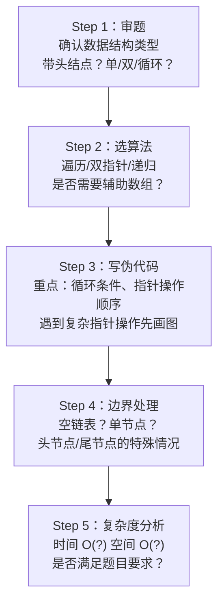

## 结构体与链表做题方法全面总结

---

## 第一部分：结构体基础

### 1.1 结构体定义

```c
// 标准定义
struct ListNode {
    int val;
    struct ListNode *next;
};

// 常见变形
typedef struct LNode {
    int data;
    struct LNode *next;
} LNode, *LinkList;    // LNode是结构体类型，LinkList是指针类型
```

**408 考点**：`LinkList` 和 `LNode *` 是等价的，都是指向节点的指针。但语义不同：
- `LinkList` 强调这是一个链表头指针
- `LNode *` 强调这是一个节点指针

### 1.2 结构体大小的计算

**408 选择题考点**：结构体对齐

```c
struct Example {
    char a;    // 1字节 → 偏移0
    int b;     // 4字节 → 偏移4（不是1！）
    short c;   // 2字节 → 偏移8
};
// 总大小 = 12字节（不是7！）
```

**对齐规则**：
1. 每个成员的起始偏移 = min(对齐系数, 自身大小) 的整数倍
2. 结构体总大小为最大成员对齐值的整数倍
3. 默认对齐系数取决于编译器和平台（通常 4 或 8）

---

## 第二部分：链表基础操作模板

### 2.1 带头结点 vs 不带头结点

```c
// === 带头结点（教材408默认） ===
// 头结点是哨兵，不存数据，L->next指向第一个数据节点
// 优点：插入/删除不用判断是否操作的是头节点
struct LNode *head = (LNode*)malloc(sizeof(LNode));
head->next = NULL;          // 空链表条件

// === 不带头结点 ===
// L 本身就是第一个数据节点
// 空链表条件：L == NULL
```

**408 判空条件**：

| 链表类型 | 判空条件 |
|---------|---------|
| 带头结点单链表 | `L->next == NULL` |
| 不带头结点单链表 | `L == NULL` |
| 带头结点循环链表 | `L->next == L` |
| 带头结点双链表 | `L->next == NULL` 且 `L->prior == NULL` |

### 2.2 链表的定义

```c
// 单链表
typedef struct LNode {
    int data;
    struct LNode *next;
} LNode, *LinkList;

// 双链表
typedef struct DNode {
    int data;
    struct DNode *prior, *next;
} DNode, *DLinkList;

// 静态链表（用数组模拟链表）
#define MaxSize 100
typedef struct {
    int data;
    int next;   // 数组下标（游标）
} SLinkList[MaxSize];
```

### 2.3 六种核心操作模板

#### 模板1：遍历链表

```c
// 得分点：p从第一个数据节点开始，p!=NULL为循环条件
void traverse(LinkList L) {
    LNode *p = L->next;          // 带头结点
    // LNode *p = L;             // 不带头结点
    while (p != NULL) {
        // 处理 p->data
        p = p->next;
    }
}
// ⚠️ 踩坑：条件写 p->next != NULL 会漏掉最后一个节点
```

#### 模板2：头插法

```c
// 得分点：常用于链表逆置
void insertAtHead(LinkList L, int x) {
    LNode *s = (LNode*)malloc(sizeof(LNode));
    s->data = x;
    s->next = L->next;          // 新节点指向原第一个节点
    L->next = s;                // 头结点指向新节点
}
// ⚠️ 踩坑：先改 s->next，再改 L->next，顺序不能反！
```

#### 模板3：尾插法

```c
// 得分点：需要维护一个尾指针
void insertAtTail(LinkList L, int x) {
    LNode *r = L;               // r指向尾节点
    while (r->next != NULL) r = r->next;
  
    LNode *s = (LNode*)malloc(sizeof(LNode));
    s->data = x;
    s->next = NULL;
    r->next = s;
}

// 优化：用一个尾指针始终指向最后一个节点
// 每插入一个节点，更新尾指针
```

#### 模板4：在第 i 个位置插入

```c
// 带头结点，p指向第 i-1 个节点
bool insert(LinkList L, int i, int x) {
    if (i < 1) return false;
  
    LNode *p = L;
    int j = 0;
    while (p != NULL && j < i-1) {  // 找第 i-1 个节点
        p = p->next;
        j++;
    }
    if (p == NULL) return false;    // 位置无效
  
    LNode *s = (LNode*)malloc(sizeof(LNode));
    s->data = x;
    s->next = p->next;
    p->next = s;
    return true;
}
```

#### 模板5：删除节点

```c
// 删除 p 的后继节点
LNode *q = p->next;
p->next = q->next;
free(q);

// ⚠️ 踩坑：双链表删除尾节点时，注意 p->next 是否为 NULL
// DNode *q = p->next;
// p->next = q->next;
// if (q->next != NULL) q->next->prior = p;  // ⚠️ 判空！
```

#### 模板6：按值查找

```c
LNode* findByValue(LinkList L, int x) {
    LNode *p = L->next;
    while (p != NULL && p->data != x) {
        p = p->next;
    }
    return p;   // 找到返回指针，没找到返回NULL
}
```

---

## 第三部分：链表高频算法题（7大题型）🔥🔥🔥

### 题型1：反转链表

```mermaid
flowchart LR
    A["1"] --> B["2"] --> C["3"] --> D["4"] --> E["NULL"]
    A2["NULL"] <-- B2["1"] <-- C2["2"] <-- D2["3"] <-- E2["4"]
    Style -- "反转" --> Style2
```

**三指针法（必背）**：
```c
LNode* reverse(LNode *head) {
    if (head == NULL || head->next == NULL) return head;
  
    LNode *prev = NULL, *curr = head, *next;
    while (curr != NULL) {
        next = curr->next;      // ① 保存后继（+1分）
        curr->next = prev;      // ② 反转指针（+2分）
        prev = curr;            // ③ prev后移
        curr = next;            // ④ curr后移
    }
    return prev;                // 新头
}
```

### 题型2：合并两个有序链表

```c
LinkList merge(LinkList L1, LinkList L2) {
    LinkList L = (LNode*)malloc(sizeof(LNode));
    LNode *p = L;
    LNode *p1 = L1->next, *p2 = L2->next;
  
    while (p1 != NULL && p2 != NULL) {
        if (p1->data <= p2->data) {
            p->next = p1;
            p1 = p1->next;
        } else {
            p->next = p2;
            p2 = p2->next;
        }
        p = p->next;
    }
    // 处理剩余部分
    p->next = (p1 != NULL) ? p1 : p2;
  
    free(L1);   // 释放原头结点（如需）
    free(L2);
    return L;
}
```

### 题型3：找中间节点（快慢指针）

```c
// 快指针每次两步，慢指针每次一步
// 快指针到终点时，慢指针恰好在中间
LNode* findMiddle(LinkList L) {
    LNode *slow = L->next, *fast = L->next;
    while (fast != NULL && fast->next != NULL) {
        slow = slow->next;
        fast = fast->next->next;
    }
    return slow;    // 奇数个：正中间；偶数个：靠右的那个
}
```

### 题型4：判断是否有环（快慢指针）

```c
bool hasCycle(LNode *head) {
    LNode *slow = head, *fast = head;
    while (fast != NULL && fast->next != NULL) {
        slow = slow->next;
        fast = fast->next->next;
        if (slow == fast) return true;  // 相遇 → 有环
    }
    return false;
}

// 找环入口：相遇后，一个从头走，一个从相遇点走
// 再次相遇的地方就是环入口
LNode* detectCycle(LNode *head) {
    LNode *slow = head, *fast = head;
    while (fast != NULL && fast->next != NULL) {
        slow = slow->next;
        fast = fast->next->next;
        if (slow == fast) {                     // 相遇
            LNode *p = head;
            while (p != slow) {                 // 同步走
                p = p->next;
                slow = slow->next;
            }
            return p;                           // 环入口
        }
    }
    return NULL;
}
```

### 题型5：删除倒数第 k 个节点

```c
// 快指针先走 k 步，然后快慢一起走
// 快指针到终点时，慢指针在倒数第 k 个
LNode* removeNthFromEnd(LNode *head, int k) {
    // 带头结点
    LNode *fast = head->next, *slow = head;
  
    for (int i = 0; i < k && fast != NULL; i++)
        fast = fast->next;
  
    while (fast != NULL) {
        fast = fast->next;
        slow = slow->next;
    }
  
    // slow指向待删节点的前驱
    LNode *q = slow->next;
    slow->next = q->next;
    free(q);
    return head;
}
```

### 题型6：双链表的插入与删除

```c
// === 双链表 p 之后插入 s ===
// 得分点：先连后断（先改s的prior和next，再改p和s->next的指向）
s->next = p->next;
s->prior = p;
if (p->next != NULL) p->next->prior = s;  // ⚠️ 判空！
p->next = s;

// === 双链表删除 p 的后继 q ===
LNode *q = p->next;
p->next = q->next;
if (q->next != NULL) q->next->prior = p;  // ⚠️ 判空！
free(q);
```

### 题型7：判断回文链表

```c
// ① 快慢指针找中间
// ② 反转后半部分
// ③ 逐节点比较
bool isPalindrome(LinkList L) {
    if (L->next == NULL) return true;       // 空或单节点
  
    LNode *slow = L->next, *fast = L->next;
    while (fast->next != NULL && fast->next->next != NULL) {
        slow = slow->next;
        fast = fast->next->next;
    }
    // slow 在中点（或左中点）
  
    // 反转后半段
    LNode *curr = slow->next;
    LNode *prev = NULL, *next;
    while (curr != NULL) {
        next = curr->next;
        curr->next = prev;
        prev = curr;
        curr = next;
    }
  
    // 比较
    LNode *p1 = L->next, *p2 = prev;
    while (p2 != NULL) {
        if (p1->data != p2->data) return false;
        p1 = p1->next;
        p2 = p2->next;
    }
    return true;
}
```

---

## 第四部分：408 算法题解题流程

### 4.1 通用解题步骤



### 4.2 双指针大法（408 最高频）

| 双指针类型 | 适用场景 | 典型例题 |
|-----------|---------|---------|
| **快慢指针**（不同速） | 找中间节点、判环 | 快慢指针速度=2:1 |
| **前后指针**（同速差 k 步） | 找倒数第 k 个 | 前指针先走 k 步 |
| **左右指针**（归并） | 合并有序链表 | 两个链表各一个指针 |
| **头尾指针**（相向） | 回文链表 | 反转后半段后对比 |

### 4.3 写代码的"保分"要点

```
1. 判空（+1分）：if (head == NULL) return head;

2. 带头结点的遍历（+1分）：p = L->next; while(p != NULL)

3. 插入/删除时先画图（避免指针操作顺序错误）

4. 双链表判空（+1分）：if (p->next != NULL) p->next->prior = s

5. 释放节点（+1分）：free(q)

6. 复杂度分析（+1分）：写在代码最后
```

### 4.4 408 历年真题考点分布

| 年份 | 链表考题 | 知识点 |
|------|---------|--------|
| 2023 | 单链表删除重复元素 | 遍历+释放 |
| 2022 | 双链表合并 | 归并双指针 |
| 2021 | 单链表找公共后缀 | 双指针 |
| 2020 | 单链表绝对值去重 | 辅助数组+遍历 |
| 2019 | 单链表重排 | 找中点+反转+合并 |
| 2018 | 单链表找倒数k个 | 双指针差k步 |
| 2017 | 中缀转后缀 | 栈的应用 |
| 2016 | 单链表求交集 | 归并思想 |

---

## 第五部分：结构体链表的易错点全收录 ⚠️

### ⚠️ 易错 1：malloc 后不判空

```c
LNode *s = (LNode*)malloc(sizeof(LNode));
// ❌ 忘记判空！
if (s == NULL) return;  // ✅ 养成习惯
```

### ⚠️ 易错 2：忘记释放内存

```c
// ❌ 删除节点后不free，造成内存泄漏
p->next = q->next;
free(q);    // ✅ 必须free
```

### ⚠️ 易错 3：指针操作顺序错误

```c
// ❌ 头插法写反
L->next = s;       // 先改头结点
s->next = L->next; // 这时候 s->next 指向自己！形成环

// ✅ 正确顺序
s->next = L->next;
L->next = s;
```

### ⚠️ 易错 4：对 NULL 取 next

```c
// ❌ 循环条件写出 p->next != NULL
while (p->next != NULL) {  // p 可能已经为 NULL！
    p = p->next;
}

// ✅ 应该
while (p != NULL) {  // 先检查 p 本身
    p = p->next;
}
```

### ⚠️ 易错 5：尾节点特殊处理

```c
// 双链表删除尾节点时
if (q->next != NULL)        // ⚠️ 必须判空！
    q->next->prior = p;     // 尾节点的 next 为 NULL
```

### ⚠️ 易错 6：size_t 比较有符号数

```c
// ❌ 逆序遍历时
for (int i = n-1; i >= 0; i--)  // 如果 n=0, 死循环！

// ✅ 或改为
for (int i = n; i > 0; i--)
```

---

## 第六部分：记忆口诀

```
单链表操作口诀：
头插先连后断，尾插要记尾针
遍历判 p 不判 next，判空写在最前面

双链表操作口诀：
前驱后继两根线，先接后断顺序明
若有后继先判空，避免空指针崩溃

快慢指针口诀：
快走两步慢一步，中间节点轻松得
快慢相遇必有环，同步再走是入口
```